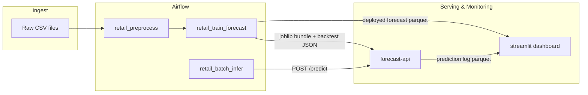

# Retail Forecast Airflow

Production-style forecasting pipeline for retail demand planning, built with **Apache Airflow 3.1**, **StatsForecast**, **FastAPI**, and **Streamlit**.

This project demonstrates a full ML workflow: dataset preparation, scheduled training, holdout evaluation, model artifact promotion, API-based inference, and lightweight monitoring.

## Project highlights

- End-to-end orchestration with Airflow DAGs (`preprocess → train → batch infer`)
- **Holdout backtesting** after each train: MAPE, RMSE, sMAPE, and a volume-weighted RMSSE-style score vs a naive last-value baseline (`ml_pipeline/evaluation.py` → `models/backtest_metrics.json`)
- Real model serving: the API loads the same **StatsForecast** bundle produced by the training DAG
- **Automated checks**: `pytest` + **Ruff** in GitHub Actions; `docker compose config` validation on each push/PR
- Containerized multi-service stack (Postgres, Airflow API server, scheduler, FastAPI, dashboard)
- Clean Python layout (`ml_pipeline/`) with thin DAGs and optional `config.rebase_paths()` for tests or local runs

## Architecture



## Tech stack

- **Apache Airflow 3.1** (workflow orchestration)
- **StatsForecast** + `SimpleExponentialSmoothingOptimized` (time-series baseline)
- **FastAPI** (inference service)
- **Streamlit** (operational dashboard)
- **Docker Compose** (local platform)
- **Pandas** + **PyArrow** (data processing + parquet I/O)
- **Pytest**, **Ruff**, **GitHub Actions** (tests and CI)

## Quickstart

### 1) Clone and enter the project

```bash
git clone <https://github.com/faizaan31/retail-forecast-airflow>
cd retail-forecast-airflow
```

### 2) Add input data

Choose one of the following:

- **Option A: generate small synthetic sample data (fast smoke test)**

```bash
pip install "pandas>=2.1"
python -m ml_pipeline.sample_data
```

- **Option B: use real M5-style files**
  - Place `sales_train_validation.csv` and `calendar.csv` inside `data/raw/`

### 3) Start the stack

```bash
docker compose build
docker compose up -d
```

### 4) Open services

- Airflow: [http://localhost:8081](http://localhost:8081) (`admin` / `admin`)
- Forecast API docs: [http://localhost:8000/docs](http://localhost:8000/docs)
- Dashboard: [http://localhost:8501](http://localhost:8501)

### 5) Run DAGs in order

1. `platform_smoke_test`
2. `retail_preprocess`
3. `retail_train_forecast` (includes **holdout_backtest_metrics** → writes `backtest_metrics.json` under the models volume, then snapshot stats and promote)
4. `retail_batch_infer`

If the API container started before training finished, reload the model bundle:

```bash
docker compose restart forecast-api
```

## Testing and CI

Local checks (Python **3.12** recommended to match CI):

```bash
pip install -r requirements-ci.txt
ruff check ml_pipeline tests dags
pytest -q
```

GitHub Actions (`.github/workflows/ci.yml`) runs **Ruff**, **pytest**, and **`docker compose config`** on pushes to `main` / `master` and on pull requests.

## Repository structure

```text
retail-forecast-airflow/
├── .github/workflows/      # CI (Ruff, pytest, compose config)
├── dags/                   # Airflow DAG definitions
├── ml_pipeline/            # preprocess, train, evaluation, API (`ml_pipeline/api/`)
├── tests/                  # Pytest (e.g. API integration with TestClient)
├── dashboard/              # Streamlit app
├── data/
│   ├── raw/
│   ├── processed/
│   └── working/
├── docker-compose.yml
├── Dockerfile
├── Dockerfile.api
├── Dockerfile.dashboard
├── requirements.txt        # Optional: local / IDE (includes Airflow)
├── requirements-ci.txt     # Lighter set for CI and quick test runs
├── LICENSE
└── README.md
```

## Notable engineering choices

- **Modular design**: DAGs call reusable functions in `ml_pipeline`; evaluation lives in `evaluation.py`, not inlined in DAG files.
- **Artifact consistency**: training writes model bundle, forecast parquet, and evaluation JSON on shared volumes used by the API and dashboard where applicable.
- **Nixtla ID column**: `NIXTLA_ID_AS_COL=1` is set in package init and Docker images to reduce ambiguous index/column states from `predict()`.
- **Local-first security defaults**: compose supports `.env` overrides for Fernet/JWT keys; change defaults before any shared deployment.
- **Fast iteration**: preprocessing sampling and evaluation `max_series` caps keep laptop and CI runs bounded.

## Troubleshooting

- **Import issues in DAGs**: containers set `PYTHONPATH=/opt/airflow`, so `import ml_pipeline` resolves correctly.
- **Data permission issues (Linux)**: align host permissions for `./data` (or set `AIRFLOW_UID` appropriately).
- **Airflow execution auth errors**: all Airflow services must share the same Fernet and execution JWT keys (compose defaults align them).

## Future improvements

- **Cloud deployment**: profiles or docs for managed Airflow, container registry, and secrets manager
- **Model registry**: versioned artifacts, promotion gates tied to backtest thresholds
- **More tests**: unit tests for `evaluation.py` metrics helpers; optional DAG parse smoke tests in CI
